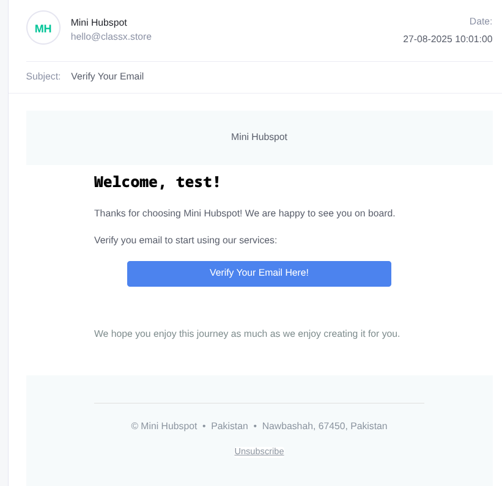

# Mini HubSpot  

A lightweight HubSpot alternative built in **Go** with **PostgreSQL**.  
Features authentication, subscription plans, and customer management tools.  

---

## Features
- User authentication with email verification & role-based access control  
- Subscription system with **Stripe integration**  
- Customer & contact management  
- Search, filtering, pagination, CSV export  
- Background tasks with cron jobs  
- REST API with Postman collection  

---

## Tech Stack
- Go  
- PostgreSQL + sqlc + goose  
- Stripe  
- Docker  

---

## Getting Started

### Prerequisites
- Go 1.21+
- PostgreSQL
- Stripe account

### Setup
```bash
git clone https://github.com/MudassirDev/mini-hubspot.git
cd mini-hubspot
cp .env.example .env # setup env variables
go run main.go
```

### DB Migrations:
```bash
cd db/migrations && goose postgres $DATABASE_URL up
```

---


## Testing
**Stripe Test Cards:**
- Success: `4242424242424242`
- Declined: `4000000000000002`

---
## Screenshots


---

## Current Status
✅ Authentication & email verification  
✅ Contact CRUD with search/filter/pagination  
✅ Stripe payment integration  
✅ RBAC backend implementation  
⚠️ Frontend email verification UI pending  
⚠️ Admin panel for RBAC pending  

---

## License
MIT
